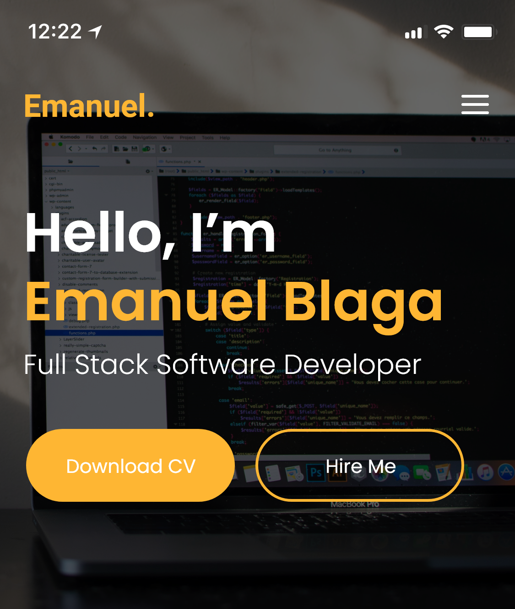

# Emanuel Blaga Portofolio website
Stream One Project: User-Centric Frontend Development - Code Institute.

This is my portfolio website to present to prospective employers. The portfolio highlights two projects that covers a range of technologies, as well as including a bit about myself, my coding skills, and a contact form. 
I wanted to comunicate technology via a modern design prefering ilustrations and light spectrum colors ( Anything than comes from the variation of natural lights such as white, yellow , red, blue  to bridge  with my lighting engineer experience 

## Wireframe

Adobe XD was used to create the wireframe and style of this website. 
### Desktop version

### Mobile version

 
 The PDF version can be found [here](ASSETS/MEDIA/Portofolio_website_project.pdf) 

# Features

This website has 5 main sections that includes 

   1. A modern landing page containing basic information such as name and profession on a contrast background to remind of technology
   2. A brief introduction about me along with my contact details and an ilustration that represents myself and is in harmony  with general theme of this website, 
   3. A visual icons style presentation of my skills so far with more to add in the future benefiting from hover anymation in line with website colors, 
   4. A section where I present my portofolio projects large visual icon style images along with project description and git and desktop icons for an easy access to the websites and the source code 
   5. A contact form reset section with a modal to warn the users about collecting of personal data.  

## Existing Features 
### Feature 1 - allows users  to download my CV by clicking the download button
### Feature 2 - allows users  to jump directly to the conact form by pressing Hire me/ Contact me button
### Feature 3 - allows users  to open a new tab with my portofolio projects by clicking on the portofolio project picture or desctop icon 
### Feature 4 - allows users  to view more portofolio projects by pressing the View All button ( to be developped in the future as I complete more portofolio projects)
### Feature 5 - allows users  to fill in the contact form with their details and press the send button for a modal pop up that informs them about their data colection and asks to confirm they understand
### Feature 6 - allows users  to open a new tab with my twitter/linkedin/github personal accounts by clicking on any of the footer icons

For some/all of your features, you may choose to reference the specific project files that implement them, although this is entirely optional.

In addition, you may also use this section to discuss plans for additional features to be implemented in the future:

##Features Left to implement

### Feature 4 - allows users  to view more portofolio projects by pressing the View All button ( to be developped in the future as I complete more portofolio projects)
### Feature New - Add more portofolio projects 
### Feature New - Add more skills to the list
### Feature New - Make contact form functional and interactive by colecting data
### Feature New - Add a privacy policy document

## Technologies
HTML
CSS
Bootstrap (3.3.7)
Features

# Testing

If you try to submit the contact form with an invalid email address, there will be no error noting the invalid email address as this is a reset button for now to be developped in the future . Furthermore, the 'required' attribute is added to the 'name,' 'email,' and 'message' fields, but for now even if those fields are not filled in, the form will reset.

All links will open in a new tab using 'target="_blank"' and the CV will download to your default folder for downloads on click using the 'download' attribute. All links have been manually tested to ensure that they are pointing to the correct destination.

This site was tested across multiple browsers (Chrome, Safari, Internet Explorer) and on  mobile devices (iPhone 11Max) to ensure compatibility and responsiveness. The about me background images poses some chalanges particularly on samller screens wher it tends to move up in Z

## Deployment
This site is hosted using GitHub pages, deployed directly from the master branch. The deployed site will update automatically upon new commits to the master branch. In order for the site to deploy correctly on GitHub pages, the landing page must be named index.html.

To run locally, you can clone this repository directly into the editor of your choice by pasting git clone  https://manub7.github.io/Portofolio-website-2/ into your terminal. To cut ties with this GitHub repository, type git remote rm origin into the terminal.

### Media
All photos were taken from Unsplash (https://unsplash.com/), a stock image library or ilustration created in Adobe XD and then converted into .svg or PNG format that belong to me. 
All icons were taken from Font Awsome (https://fontawesome.com)

# Credits

Content
All content in the "About Me and "Work" sections in this portfolio site were written by me.

### Acknowledgements

Colapsable hamburger menu with animation was found [here](https://mdbootstrap.com/docs/jquery/navigation/hamburger-menu/)

